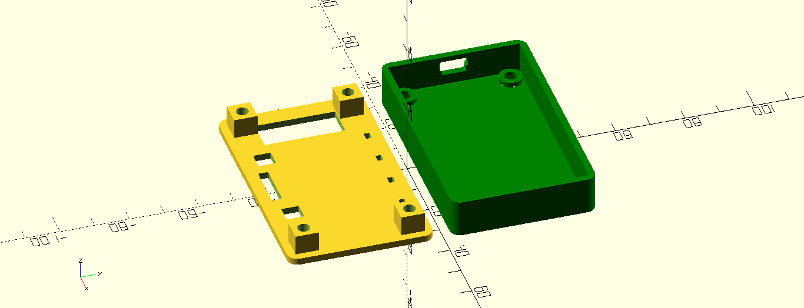
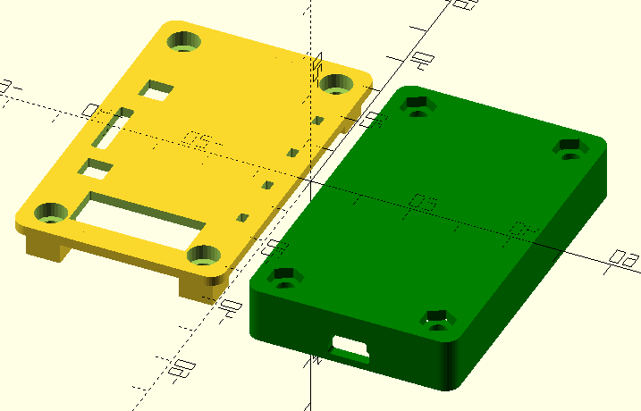

# Case for Bus Pirate v4
This is a SCAD Model for a Bus Pirate v4. 
Original design comes from here: http://www.thingiverse.com/thing:3230273 by giuliof.

**WORK IN PROGRESS!**
This Model for OpenSCAD is not finished and has not been printed by me.

 

 

# LICENSE

<dl>
 Dieses Werk ist lizenziert unter einer <a rel="license" href="http://creativecommons.org/licenses/by-sa/4.0/">Creative Commons Namensnennung - Weitergabe unter gleichen Bedingungen 4.0 International Lizenz</a>.
</dl>

<dl>
 This work is licensed under a <a rel="license" href="http://creativecommons.org/licenses/by-sa/4.0/">Creative Commons Attribution-ShareAlike 4.0 International License</a>.
</dl>
