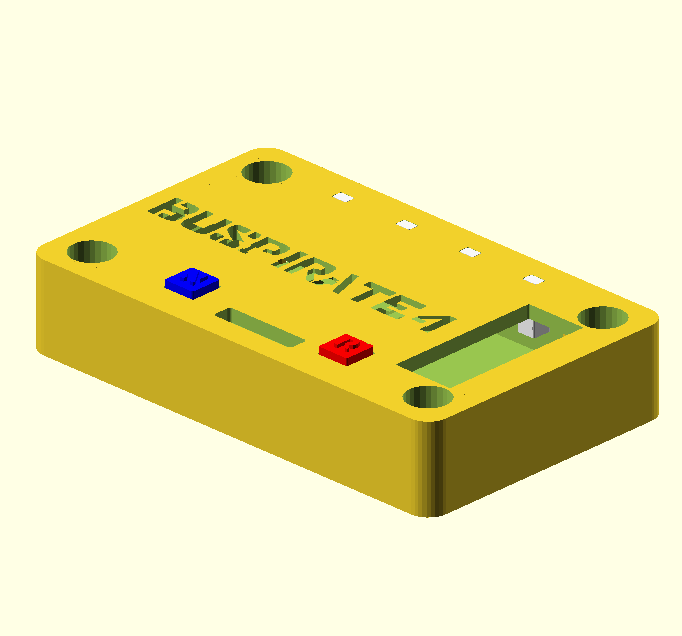
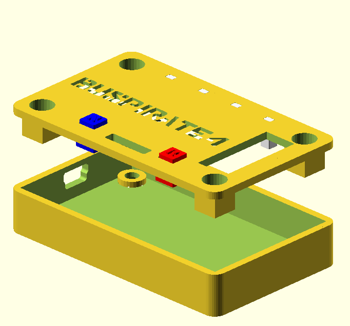
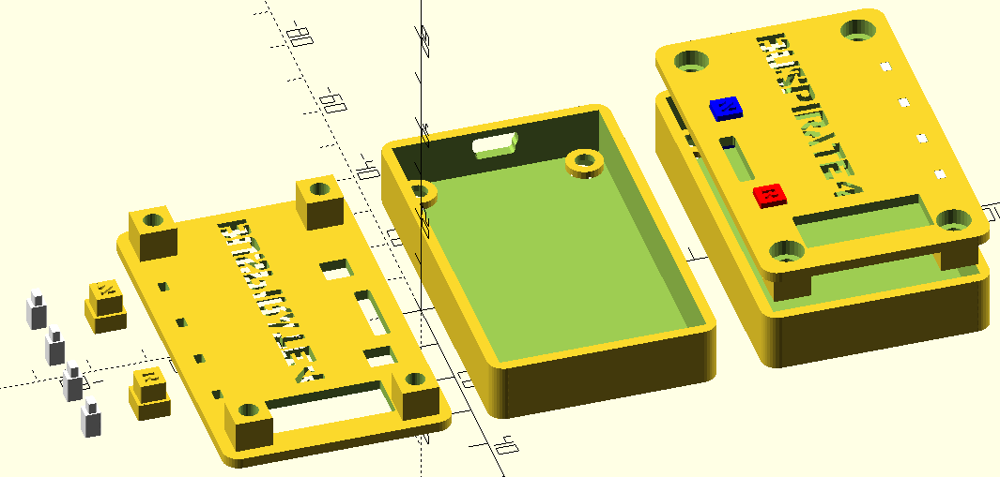
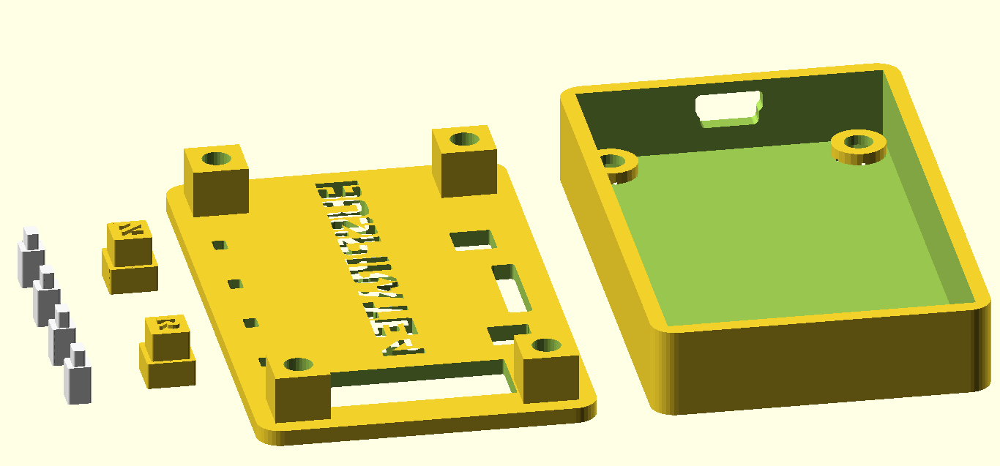

# Case for Bus Pirate v4
This is a SCAD Model for a Bus Pirate v4. 
Original design comes from here: 
 
for BusPirate v4: https://www.thingiverse.com/thing:431167 by spapadim
 
for BusPirate v4 http://www.thingiverse.com/thing:3230273 by giuliof
 
for BusPirate v3.6 https://www.thingiverse.com/thing:102133 by foosel
 

**WORK IN PROGRESS!**
This Model for OpenSCAD has not been printed by me. I will upload photos
of the printed case.

 

 

 

 

 

 
 
 

# LICENSE

<dl>
 Dieses Werk ist lizenziert unter einer <a rel="license" href="http://creativecommons.org/licenses/by-sa/4.0/">Creative Commons Namensnennung - Weitergabe unter gleichen Bedingungen 4.0 International Lizenz</a>.
</dl>

<dl>
 This work is licensed under a <a rel="license" href="http://creativecommons.org/licenses/by-sa/4.0/">Creative Commons Attribution-ShareAlike 4.0 International License</a>.
</dl>
